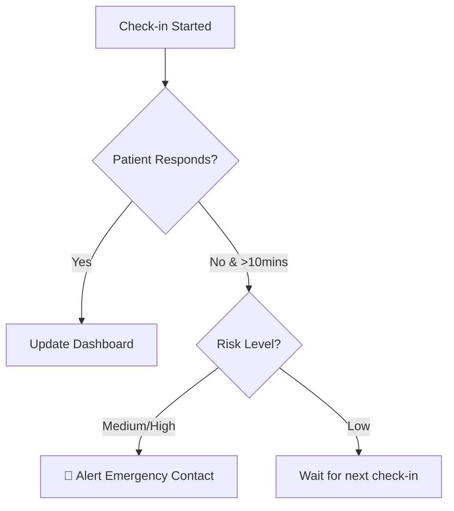

# 🏥 PatientAgent: Autonomous Post-Surgery WhatsApp Follow-up Agent

<div align="center">
  
  
  
  
</div>

---

## 🚀 Unique Selling Proposition (USP)
**"A proactive AI recovery companion that automates post-operative symptom monitoring via WhatsApp and implements a fail-safe emergency logic by instantly alerting secondary contacts if a patient becomes unresponsive during a critical health check-in."**

---

## 🌟 Key Features
- **🤖 Autonomous AI Chatbot:** Conducts structured medical check-ins (Pain, Temperature, Symptoms) natively on WhatsApp.
- **🚨 10-Minute Fail-Safe Watcher:** Background thread monitors active check-ins. If a patient is high-risk and stops replying for 10 minutes, an emergency alert is sent to a secondary contact.
- **📊 Doctor's Command Center:** A premium, real-time dashboard featuring live patient monitoring, risk-score visualizations, and instant alerts.
- **🧠 Risk Score Engine:** Rule-based medical NLP (upgradable to LLM) that calculates patient risk from 0-100% and categorizes them as *Recovering*, *Alert*, or *Critical*.

---

## 🛠️ Technology Stack
- **Backend:** Python (Flask), SQLAlchemy (SQLite)
- **Messaging:** Twilio WhatsApp Business API
- **Frontend:** Vanilla JS, CSS (Glassmorphism design), Chart.js
- **Environment:** Docker & Docker-Compose

---

## 🏃 Quick Start Guide

### 1. Prerequisites
- [Twilio Account](https://www.twilio.com/) (Trial works!)
- Docker installed on your system.

### 2. Setup Configuration
Create a `.env` file in the root directory:
```env
TWILIO_ACCOUNT_SID=your_sid
TWILIO_AUTH_TOKEN=your_token
TWILIO_WHATSAPP_NUMBER=whatsapp:+14155238886
DOCTOR_PHONE=+91XXXXXXXXXX
```

### 3. Launch App
```bash
docker-compose up -d
```
- **Dashboard:** `http://localhost:8080`
- **Backend API:** `http://localhost:5000`

---

## 🩺 System Workflow
1. **Initiate:** The Doctor clicks "Check-in" on the dashboard.
2. **Interact:** The patient receives a WhatsApp message and provides their recovery status interactively.
3. **Analyze:** The backend calculates the risk score and updates the dashboard in real-time.
4. **Alert:** If the patient reports severe symptoms OR goes "Inactive" during a high-risk chat, the emergency protocol triggers.

---

## 🛡️ Fail-Safe Mechanism (Logic Flow)


---

<div align="center">
  <sub>Built for <b>Hackathon Evaluation</b> by Nitish Reddy & Team.</sub>
</div>
